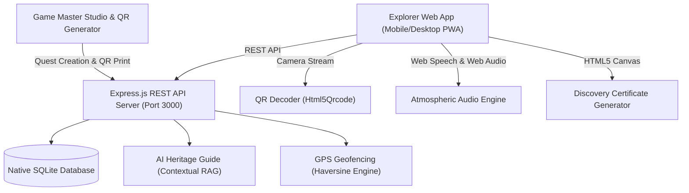

# 🏛️ Heritage Quest — Gamified Heritage Exploration Platform

[](https://nodejs.org)
[](https://expressjs.com)
[](https://sqlite.org)
[](LICENSE)

> **Hackathon Problem Statement:**
> Heritage sites are valuable sources of history and culture, but many visitors experience them only as places to see rather than stories to discover. Traditional heritage applications mainly provide static information, images, or simple quizzes, which fail to create active participation or sustained interest. 
>
> **Solution:**
> **Heritage Quest** is a gamified, real-world exploration platform that transforms historical monuments into interactive treasure hunts using **GPS geofencing, QR cipher markers, architectural puzzles, historical narratives, NPC dialogues, an AI Heritage Guide, and cryptographically verified certificates of discovery.**

---

## 🌟 Key Features

### 1. 🧭 Multi-Site Historical Expeditions
- **The Lost Royal Seal of Vijayanagara (Hampi, Karnataka)** — 16th-century court scribe journal mystery.
- **The Nizam's Secret Vault (Golconda Fort, Hyderabad)** — Acoustic whispering arches, diamond cutter geometry, and subterranean cisterns.
- **The Celestial Code of Konark (Sun Temple, Odisha)** — 24 solar sundial wheels, lodestone calibration, and master architect legends.

### 2. 🗺️ GPS Geofencing & Interactive Radar Map
- Integrated **Leaflet.js** dark-atmosphere satellite/tactical map.
- Live GPS tracking with real-time distance calculation using the **Haversine formula**.
- Proximity radar with glowing geofence boundaries (40m radius).
- **Demo Mode Toggle**: Allows hackathon judges and indoor evaluators to bypass physical GPS distance checks and simulate walking coordinates with a single click.

### 3. 📷 Physical QR Scanner & Inscription Gates
- Built-in camera QR scanner (`html5-qrcode`) to scan physical markers placed on monument stones.
- Fallback manual selection system for indoor or low-light situations.
- Multi-gate mechanics: **MCQ historical inscriptions, QR Mason ciphers, Symbol/Pattern stone puzzles, and Interactive NPC Ghost dialogues.**

### 4. 🤖 AI Heritage Guide (RAG-Powered)
- Contextual AI Guide chatbot accessible at every stage of the hunt.
- Queries a curated knowledge base of historical records, ruler lineages, architectural principles, and subtle progressive hints.

### 5. 🔊 Audio Storytelling & Speech Synthesis
- Voice narration using the **Web Speech API** to read the court scribe's notes aloud.
- Authentic sound effects (ancient temple bell, drum strikes, seal unlock, chime) powered by the **Web Audio API**.

### 6. 📜 Dynamic Parchment Certificate of Discovery
- Real-time HTML5 Canvas certificate renderer with antique parchment textures, wax seals, team name, completion time, score, and verification hash.
- 1-Click **PNG Download** and **Print** functionality.

### 7. 🛠️ Game Master Studio & Quest Creator
- Visual interface for museum curators, park rangers, and educators to create custom treasure hunts.
- One-click **4-Up Printable QR Marker Generator** to print sheets and mount on monument pillars.

### 8. 🌐 Multilingual & Offline PWA Ready
- Full multi-language support (**English, Hindi / हिन्दी, Kannada / ಕನ್ನಡ**).
- **Service Worker (`sw.js`)** offline caching for exploration inside thick granite fort walls with intermittent network reception.

---

## 🏗️ Architecture



---

## 🚀 Quick Start

### 1. Prerequisites
- **Node.js** v18+ (tested on Node v24)
- **npm** v9+

### 2. Installation
```bash
# Navigate to project directory
cd "C:\Users\Windows\.gemini\antigravity\scratch\heritage-quest"

# Install dependencies
npm install
```

### 3. Run Server
```bash
# Start production server
npm start

# Or start in watch mode for development
npm run dev
```

### 4. Open in Browser
Visit **[http://localhost:3000](http://localhost:3000)** on your phone or desktop.

---

## 🧪 Testing & Verification

Run the automated backend test suite:
```bash
node test_api.js
```
This tests:
- Quest discovery and details endpoint
- Session lifecycle & player registration
- Checkpoint verification (MCQ, QR, Symbol, Dialogue)
- Geofence calculation logic
- Hint point deduction
- AI Guide responses
- Quest completion, badge triggers, and certificate code generation
- Leaderboard ranking and platform analytics

---

## 📡 REST API Reference

| Method | Endpoint | Description |
| :--- | :--- | :--- |
| `GET` | `/api/quests` | List all heritage quests |
| `GET` | `/api/quests/:id` | Get full quest details and checkpoints |
| `POST` | `/api/quests` | Create a custom quest (Game Master) |
| `POST` | `/api/sessions/start` | Start a new exploration session |
| `POST` | `/api/checkpoints/verify` | Validate GPS distance & puzzle solution |
| `POST` | `/api/hints/hint` | Request a hint (-20 pts penalty) |
| `POST` | `/api/sessions/complete` | Validate final deduction & award badges |
| `GET` | `/api/leaderboard?quest_id=` | Retrieve top ranked teams |
| `POST` | `/api/ai/ask` | Contextual AI Heritage Guide query |
| `GET` | `/api/cert/verify/:code` | Cryptographic certificate verification |
| `GET` | `/api/admin/stats` | Platform analytics & explorer statistics |

---

## 🏆 Hackathon Demo Script (3-Minute Presentation)

1. **The Hook (30s):** Open `http://localhost:3000`. Show the multi-quest hub. Explain that visitors to Hampi or Golconda usually just look at stone ruins without knowing the hidden stories.
2. **The Field Mission (60s):**
   - Select *The Lost Royal Seal*, enter a team name, and click **Begin the Hunt**.
   - Show the HUD with progress seals, timer, and language switcher (EN/HI/KN).
   - Click **🗺️ Map** to show the Leaflet radar map with geofences and player location.
   - Solve Checkpoint 1 (MCQ: Jai).
   - Open camera or tap the code on Checkpoint 2 (QR: MASON-108).
   - Click 🤖 **AI Guide** and ask *"Who built this fort?"* to demonstrate historical RAG.
   - Solve Checkpoint 3 (Symbol) and Checkpoint 4 (Ghost NPC).
3. **The Climax & Rewards (60s):**
   - Assemble the four journal fragments on the **Final Reconstruction** screen.
   - Reveal the Royal Seal animation, score summary, and badges.
   - Click **📜 View Discovery Certificate** to display the high-res canvas parchment certificate and click **Download PNG**.
   - Open **Game Master Studio** to demonstrate custom quest creation and the **Printable QR Marker Sheet**.

---

## 📄 License
MIT License — Built with ❤️ for Heritage Preservation and Cultural Tourism.
